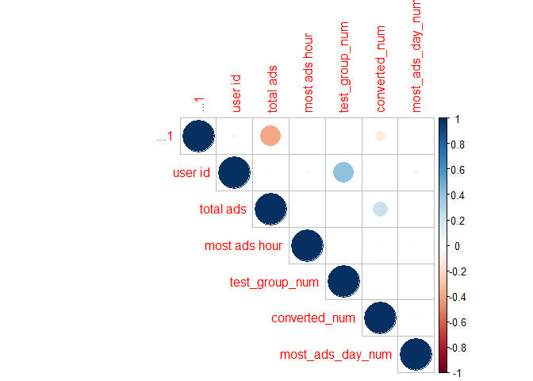
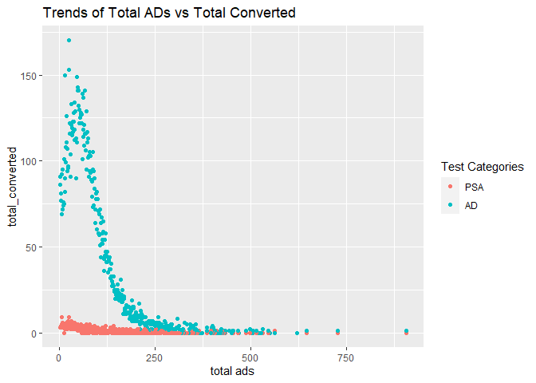

## Data Source:

<https://www.kaggle.com/datasets/faviovaz/marketing-ab-testing/>

## Data information:

-   Index: Row index
-   user id: User ID (unique)
-   test group: If “ad” the person saw the advertisement, if “psa” they
    only saw the public service announcement
-   converted: If a person bought the product then True, else is False
-   total ads: Amount of ads seen by person
-   most ads day: Day that the person saw the biggest amount of ads
-   most ads hour: Hour of day that the person saw the biggest amount of
    ads

# Prepare the library

``` r
library(readr)
library(dplyr)
```

    ## 
    ## Attaching package: 'dplyr'

    ## The following objects are masked from 'package:stats':
    ## 
    ##     filter, lag

    ## The following objects are masked from 'package:base':
    ## 
    ##     intersect, setdiff, setequal, union

``` r
library(tidyverse)
```

    ## ── Attaching core tidyverse packages ──────────────────────── tidyverse 2.0.0 ──
    ## ✔ forcats   1.0.0     ✔ stringr   1.5.0
    ## ✔ ggplot2   3.4.2     ✔ tibble    3.2.1
    ## ✔ lubridate 1.9.2     ✔ tidyr     1.3.0
    ## ✔ purrr     1.0.1

    ## ── Conflicts ────────────────────────────────────────── tidyverse_conflicts() ──
    ## ✖ dplyr::filter() masks stats::filter()
    ## ✖ dplyr::lag()    masks stats::lag()
    ## ℹ Use the conflicted package (<http://conflicted.r-lib.org/>) to force all conflicts to become errors

``` r
library(readr)
library(corrplot)
```

    ## corrplot 0.92 loaded

``` r
library(mosaic)
```

    ## Registered S3 method overwritten by 'mosaic':
    ##   method                           from   
    ##   fortify.SpatialPolygonsDataFrame ggplot2
    ## 
    ## The 'mosaic' package masks several functions from core packages in order to add 
    ## additional features.  The original behavior of these functions should not be affected by this.
    ## 
    ## Attaching package: 'mosaic'
    ## 
    ## The following object is masked from 'package:Matrix':
    ## 
    ##     mean
    ## 
    ## The following object is masked from 'package:purrr':
    ## 
    ##     cross
    ## 
    ## The following object is masked from 'package:ggplot2':
    ## 
    ##     stat
    ## 
    ## The following objects are masked from 'package:dplyr':
    ## 
    ##     count, do, tally
    ## 
    ## The following objects are masked from 'package:stats':
    ## 
    ##     binom.test, cor, cor.test, cov, fivenum, IQR, median, prop.test,
    ##     quantile, sd, t.test, var
    ## 
    ## The following objects are masked from 'package:base':
    ## 
    ##     max, mean, min, prod, range, sample, sum

``` r
library(lemon)
```

    ## 
    ## Attaching package: 'lemon'
    ## 
    ## The following object is masked from 'package:purrr':
    ## 
    ##     %||%

``` r
library(devtools)
```

    ## Loading required package: usethis

``` r
library(hablar)
```

    ## Warning: package 'hablar' was built under R version 4.3.1

    ## 
    ## Attaching package: 'hablar'
    ## 
    ## The following object is masked from 'package:mosaic':
    ## 
    ##     mean_
    ## 
    ## The following object is masked from 'package:forcats':
    ## 
    ##     fct
    ## 
    ## The following object is masked from 'package:tibble':
    ## 
    ##     num
    ## 
    ## The following object is masked from 'package:dplyr':
    ## 
    ##     na_if

# Step 1: Loading and examining data

``` r
marketing_AB <- read_csv("D:/Learn/GitFile/AB_Testing_Analysis_1/marketing_AB.csv")
```

    ## New names:
    ## Rows: 588101 Columns: 7
    ## ── Column specification
    ## ──────────────────────────────────────────────────────── Delimiter: "," chr
    ## (2): test group, most ads day dbl (4): ...1, user id, total ads, most ads hour
    ## lgl (1): converted
    ## ℹ Use `spec()` to retrieve the full column specification for this data. ℹ
    ## Specify the column types or set `show_col_types = FALSE` to quiet this message.
    ## • `` -> `...1`

``` r
M <-marketing_AB %>% 
  arrange(desc(`total ads`))

group_in_test<-M %>% 
  group_by(`test group`) %>% 
  summarize(ad_group = count(`test group`))
group_in_day<-M %>% 
  group_by(`most ads day`,`test group` ) %>% 
  summarize(ad_group = count(`test group`))
```

    ## `summarise()` has grouped output by 'most ads day'. You can override using the
    ## `.groups` argument.

``` r
group_in_test
```

    ## # A tibble: 2 × 2
    ##   `test group` ad_group
    ##   <chr>           <int>
    ## 1 ad             564577
    ## 2 psa             23524

``` r
M_num <-marketing_AB %>% 
  mutate(test_group_num = ifelse(
    `test group` == 'ad', 1, 0)) %>% 
  mutate(converted_num = ifelse(
    converted == 'TRUE',1,0)) %>% 
  mutate (most_ads_day_num = ifelse(
    `most ads day` == 'Monday', 1, ifelse(
      `most ads day` == 'Tuesday', 2, ifelse(
        `most ads day` == 'Wednesday', 3, ifelse (
          `most ads day` == 'Thursday', 4, ifelse (
            `most ads day` == 'Friday', 5, ifelse (
              `most ads day` == 'Saturday', 6, 7))))))) %>% 
  subset(select = -c(`test group`,`converted`, `most ads day`))

# Check which perimeter has relationship with converted rate
Corr_M<- cor(M_num)
Corr_M_table<-round(Corr_M, 2)
corrplot(Corr_M, method="circle", type="upper", sig.level = 0.05, insig = "blank")
```



``` r
#  total ads has more relationship with converted rate

# Get the information of how many converted under the total ads and the test group
M_TTADS_TTCONV<- M_num %>%
  group_by(`total ads`, test_group_num) %>% 
  reframe(total_converted = sum(converted_num)) %>% 
  arrange(desc(`total ads`))
M_Final<- M_TTADS_TTCONV%>% 
  group_by(`total ads`) %>% 
  filter(n()>1)  ## get the data that has records both AD and PSA
M_Final
```

    ## # A tibble: 692 × 3
    ## # Groups:   total ads [346]
    ##    `total ads` test_group_num total_converted
    ##          <dbl>          <dbl>           <dbl>
    ##  1         907              0               0
    ##  2         907              1               1
    ##  3         727              0               0
    ##  4         727              1               1
    ##  5         646              0               0
    ##  6         646              1               1
    ##  7         621              0               0
    ##  8         621              1               0
    ##  9         563              0               1
    ## 10         563              1               0
    ## # ℹ 682 more rows

``` r
# See the trend of the organized data
Trend<-ggplot(M_Final, aes(x=`total ads`, y=total_converted)) +
        geom_point(aes(color =  as.factor(test_group_num))) + 
        guides(color = guide_legend(title = "Test Categories")) +
        scale_colour_discrete(labels = c("PSA", "AD") ) +
        ggtitle("Trends of Total ADs vs Total Converted")
Trend
```



        * From the data examination, we can know that:
              1. AD and PSA have a huge difference between the size, and we have to resample from the data to let the size more similar
              2. Converted rate has more relationship with total ads
              3. Even though most converted happens when total ads less than 375, we still need to make sure that all data was considerated so I choose to use total 692 data to run the statistical test (ADs = 346, PSA = 346)

# Step 2: Statisitc test

        H0: converted rate of PSA >= converted rate of AD
        H1: converted rate of PSA < converted rate of AD (Alternative Hypothesis)
        
        * significant level(α) = 0.05

``` r
ad_sample<- M_Final %>% 
  filter(test_group_num == 1)
psa_sample<- M_Final %>% 
  filter(test_group_num == 0)


prop.test(
  x =c(sum(psa_sample$total_converted), sum(ad_sample$total_converted)),
  n = c(sum(psa_sample$`total ads`), sum(ad_sample$`total ads`)),
  alternative = "less",  # test PSA is less than AD or not
  correct = FALSE  # No Yates' continuity correction
)
```

    ## 
    ##  2-sample test for equality of proportions without continuity correction
    ## 
    ## data:  c out of csum(psa_sample$total_converted) out of sum(psa_sample$`total ads`)sum(ad_sample$total_converted) out of sum(ad_sample$`total ads`)
    ## X-squared = 14339, df = 1, p-value < 2.2e-16
    ## alternative hypothesis: less
    ## 95 percent confidence interval:
    ##  -1.0000000 -0.1959869
    ## sample estimates:
    ##      prop 1      prop 2 
    ## 0.006110009 0.204678021

# Step 3: Analyze the reault:

        * p-value is closed to 0 (<< α) so the chance of PSA converted rate > AD converted rate is really small so we can reject H0
        
        

# Conclusion: The PSA method is not better than AD
